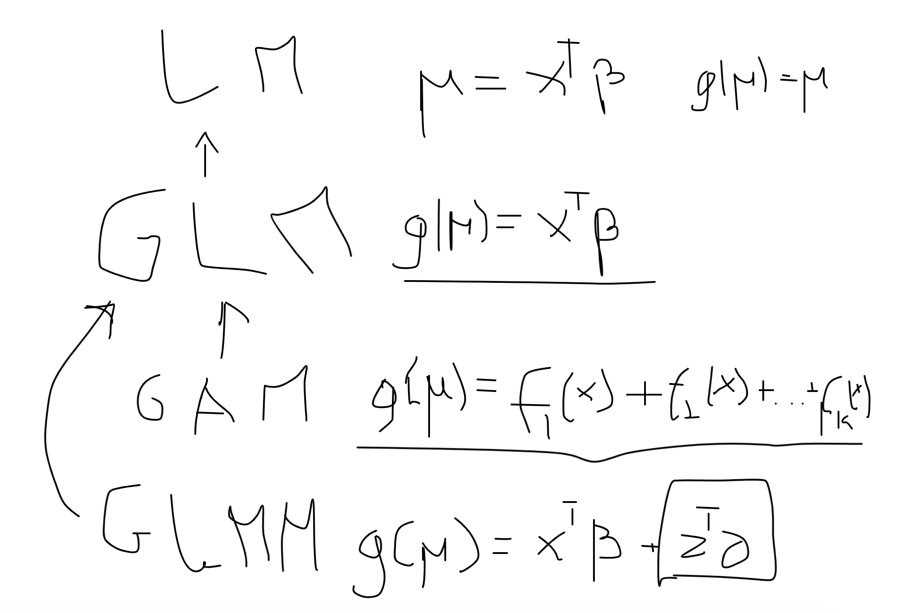

# GLM in the context



# Poisson distribution

We will show that Poisson distribution is actually 

$$
f(y, \mu)  = \frac{e^{-\mu}\mu^y}{y!}
$$


Poisson distribution to exponential distribution

$$
f(y, \mu) = \exp( \log( f(y,\mu) ) )
$$

$$
e^{\log a} = a
$$

$$
f(y,\mu) = \exp( \log( \frac{e^{-\mu}\mu^y}{y!} ) ) =  \exp( \log(e^{-\mu}\mu^y) - \log(y!))  = 
\exp( log(e^{-{\mu}}) + \log(\mu^y) - log(y!)) = 
\exp(y \log(\mu) -\mu - \log(y!))
$$

$$
\begin{split}
f(y, \mu) = & \exp(y \log(\mu) -\mu - \log(y!)) = \exp\left(\frac{y \theta - b(\theta)}{\phi} + c(y, \theta) \right)\\
\theta = & \log(\mu) \\
b(\theta) = & \exp(\theta) = \exp(log(\mu)) = \mu \\
\phi =& 1 \\
c(y, \phi) = & - \log(y!) 
\end{split}
$$


# Binomial distribution

Now, we will show that binomial distribution can be written as exponential distribution

$$
f(y, p)=p^{y}(1-p)^{1-y}
$$

$$
\begin{split}
\exp( \log(p^y(1-p)^{1-y})) = & \exp( \log(p^y) + \log((1-p)^{1-y})) = \\
\exp(y \log(p)  + (1-y)\log(1-p)) = &  \exp(y \log(p) - y\log(1-p) + \log(1-p) ) = \\
\exp\left( y ( \log\left( \frac{p}{1-p} \right) ) +  \log(1-p)\right)
\end{split}
$$

Methods to estimate parameters

1. Iteratively (Re)weighted Least Squares Algorithm (Fisher Scoring)
2. Newton-Raphson Algorithm


https://documentation.sas.com/?docsetId=statug&docsetVersion=15.1&docsetTarget=statug_logistic_details05.htm&locale=en


## Sparse matrices

```{r}
library(Matrix)
```

```{r}
m <- diag(1:10)
m
```

```{r}
m_sparse <- Diagonal(x = 1:10)
m_sparse
```

## Fit the linear model in GLM

```{r}
mtcars
```

```{r}
m1 <- lm(mpg  ~ wt + am + cyl + gear, data = mtcars)
summary(m1)
```

Do the same using `glm` function

```{r}
m2 <- glm(mpg  ~ wt + am + cyl + gear, data = mtcars, family = gaussian)
summary(m2)
```

```{r}
sqrt(6.812277) 
```


